# DAX.OSI

> A Virtual Operating System experience built on **.NET 9** and **Avalonia UI**.


---

## Table of Contents

- [What is DAX.OSI?](#what-is-daxosi)
- [What is DOSI.CORE?](#what-is-dosicore)
- [Gallery](#gallery)
- [Architecture Overview](#architecture-overview)
- [Project Layout](#project-layout)
- [Getting Started](#getting-started)
- [Tutorial](#tutorial)
- [Plug-in Apps](#plug-in-apps)
- [Roadmap](#roadmap)
- [License](#license)

---

## What is DAX.OSI?

**DAX.OSI** (the *DAX Open System Interface*) is a **virtual desktop operating system** that runs as a single cross-platform application. Instead of replacing your real OS, it boots inside its own window — complete with a login screen, a desktop, a window manager, default applications, and a settings hub — providing a sandboxed, themable, OS-like experience.

DAX.OSI is the **shell**: the boot screen, login flow, desktop environment, and the bundled "out-of-the-box" applications such as:

| Application | Purpose |
|---|---|
| `DOSITerminal` | Interactive command-line shell |
| `DOSIFileExplorer` | Browse and manage virtual files |
| `DOSIWebBrowser` | Embedded WebView-powered browser |
| `DOSIImageViewer` | View images |
| `DOSISettingsScreen` | System settings (accent color, fullscreen, etc.) |

Additional applications (such as a code editor / IDE) are delivered as
**plug-ins** discovered at startup from the `Plugins/` folder next to the
executable. See [Plug-in Apps](#plug-in-apps) below.

Every visible pixel is rendered with Avalonia and powered by the components exposed by **DOSI.CORE**.

---

## What is DOSI.CORE?

**DOSI.CORE** is the **engine and SDK** behind DAX.OSI. It is a separate class library that provides every reusable system service and UI primitive needed to build a DOSI experience or a DOSI application.

Think of DOSI.CORE as the *kernel + standard library* of the virtual OS:

### System Services
- `SystemCore` — central system bootstrapper, persists `SystemSettings.json`
- `SystemShutdown` / `SystemSignOut` — clean teardown lifecycle
- `UserManager` — user accounts, login, and session state
- `WallpaperManager` — desktop background management
- `AccentManager` — runtime accent/theming

### Window & Screen Management
- `WindowManager` — owns and tracks every open `DOSIWindow`
- `WindowSnapManager` — Aero-style edge snapping
- `ScreenManager` — switching between full-screen surfaces (boot → login → desktop)

### UI Component Library (`DOSI.CORE.UIComponents`)
`DOSIWindow`, `DOSIButton`, `DOSITextBox`, `DOSILabel`, `DOSIDropDown`,
`DOSIScrollViewer`, `DOSIScrollBar`, `DOSITabControl`, `DOSISlider`,
`DOSIDialog`, `DOSIPopNotification`, `DOSIContextMenu`, `DOSICodeEditor`,
`DOSITerminalIO`.

### Animations
`Tween`, `Easings`, `DOSILoadingAnim`, `DOSISuccessAnim`.

### Project & Designer System
- `DOSIProject`, `DOSIProjectCompiler`, `DOSIPublishedAppRegistry`
- `DOSIDesigner`, `DOSIFormCodeBehind`, `DOSIFormHandlerCompiler`

### Terminal Subsystem
- `DOSITerminalManager` — coordinates terminal sessions and command dispatch

> In short: **DAX.OSI is the operating system you see. DOSI.CORE is what makes it tick.**

---

## Gallery

> A visual tour of DAX.OSI in action — boot screens, the desktop, default apps, the IDE, and the visual designer.

<table>
  <tr>
    <td width="33%"><a href="img/1.png"></a></td>
    <td width="33%"><a href="img/2.png">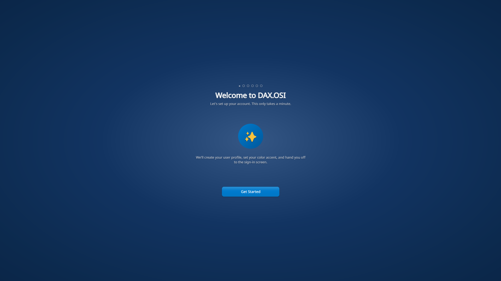</a></td>
    <td width="33%"><a href="img/3.png">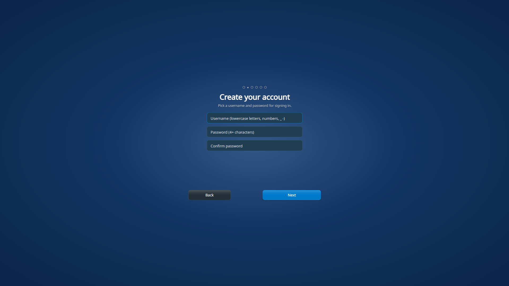</a></td>
  </tr>
  <tr>
    <td><a href="img/4.png">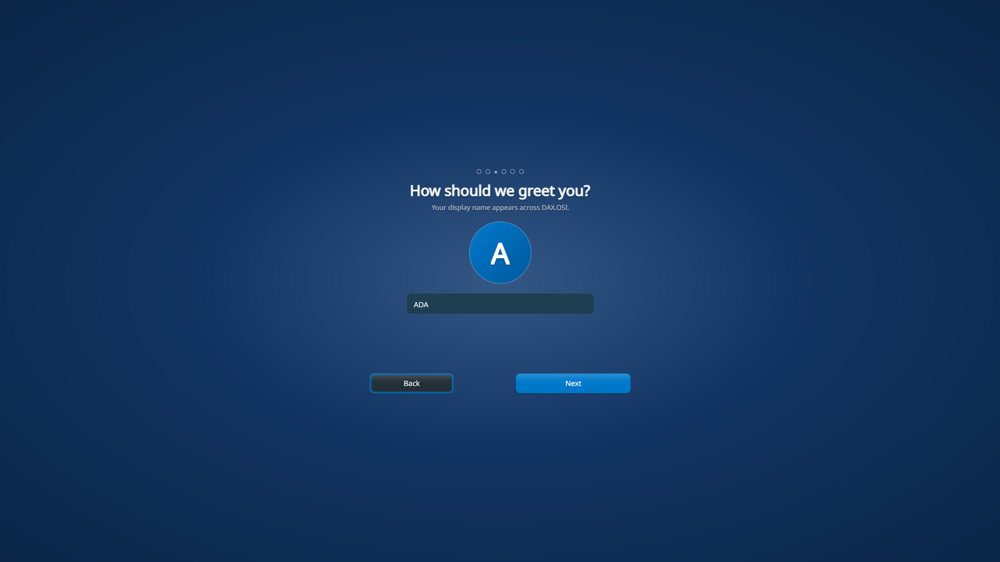</a></td>
    <td><a href="img/5.png">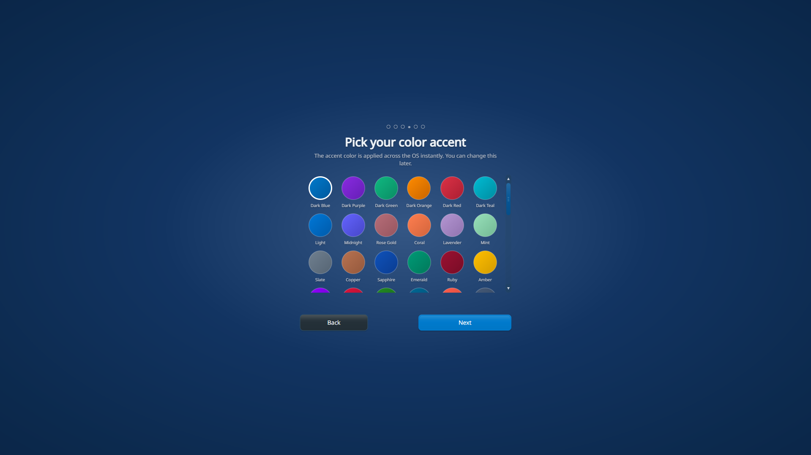</a></td>
    <td><a href="img/6.png">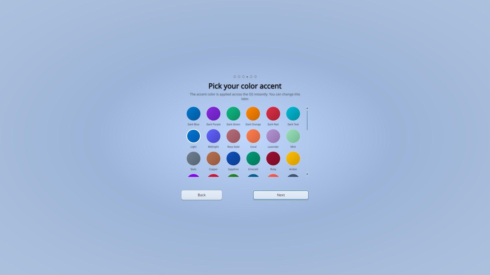</a></td>
  </tr>
  <tr>
    <td><a href="img/7.png">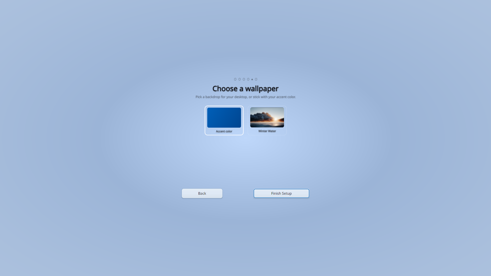</a></td>
    <td><a href="img/8.png">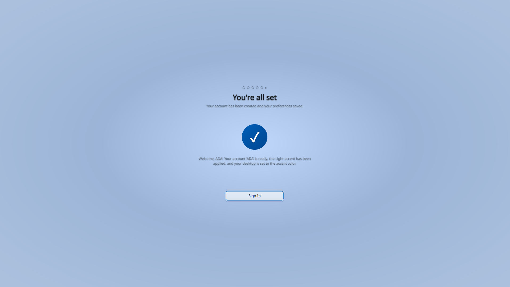</a></td>
    <td><a href="img/9.png">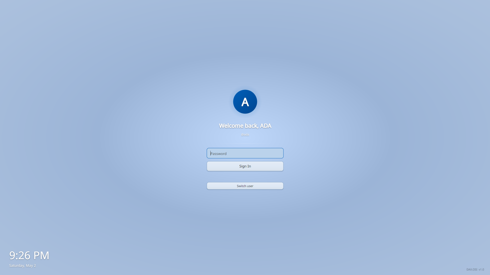</a></td>
  </tr>
  <tr>
    <td><a href="img/10.png">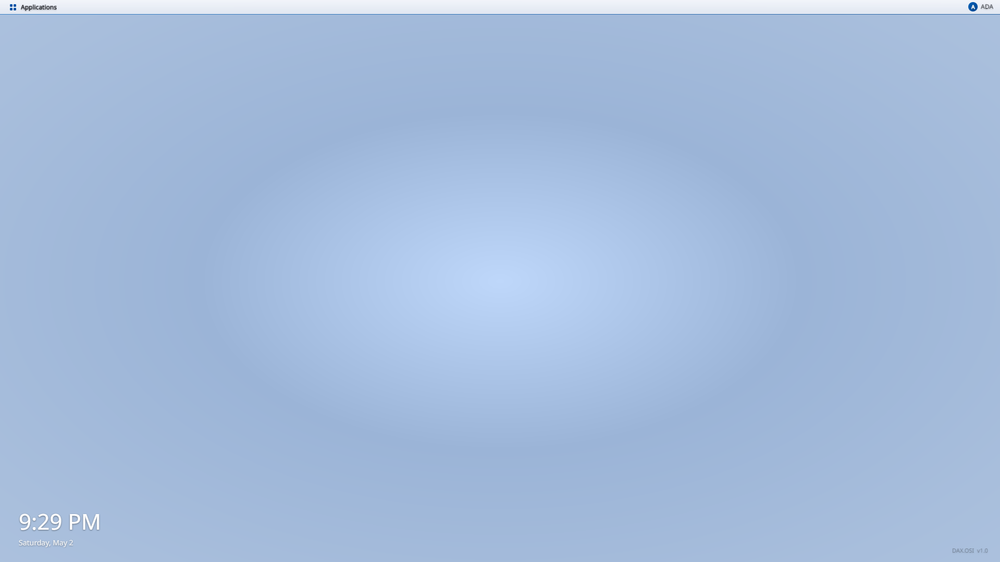</a></td>
    <td><a href="img/11.png">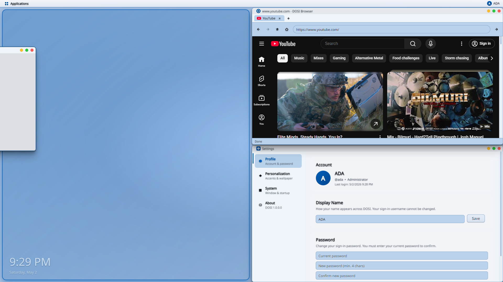</a></td>
    <td><a href="img/12.png">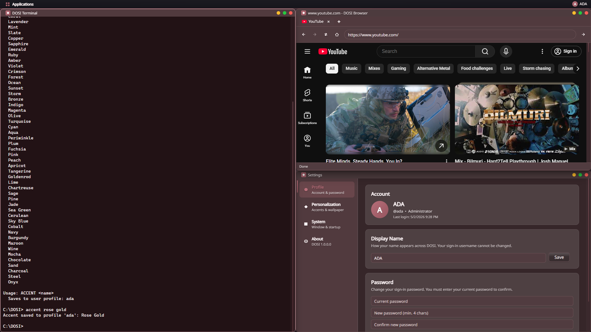</a></td>
  </tr>
  <tr>
    <td><a href="img/13.png">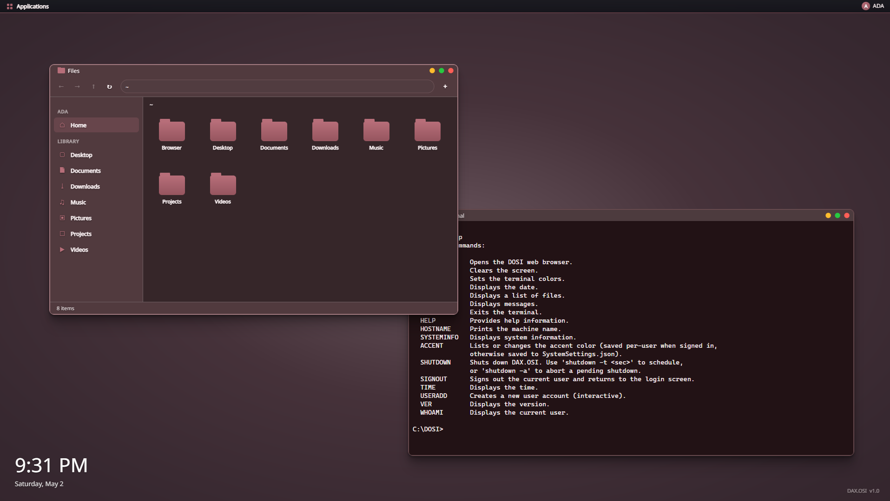</a></td>
    <td><a href="img/14.png">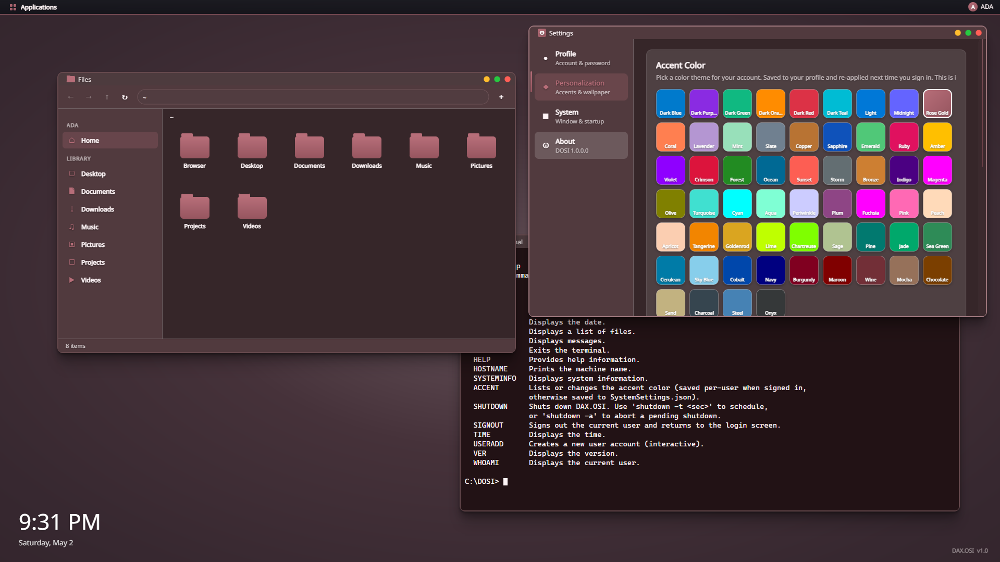</a></td>
    <td><a href="img/15.png">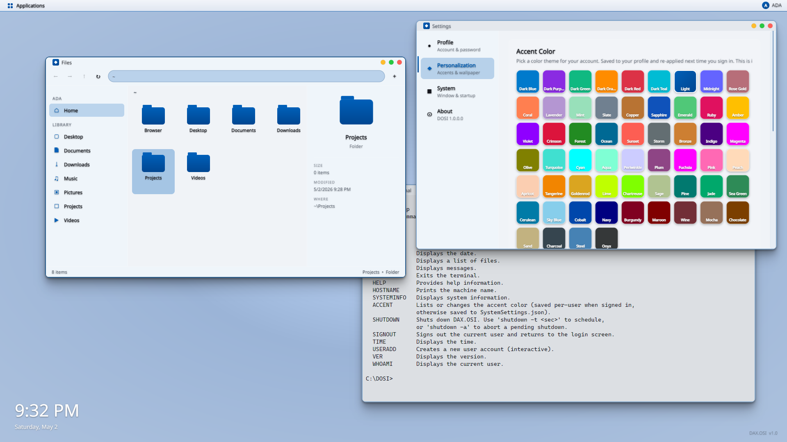</a></td>
  </tr>
  <tr>
    <td><a href="img/16.png">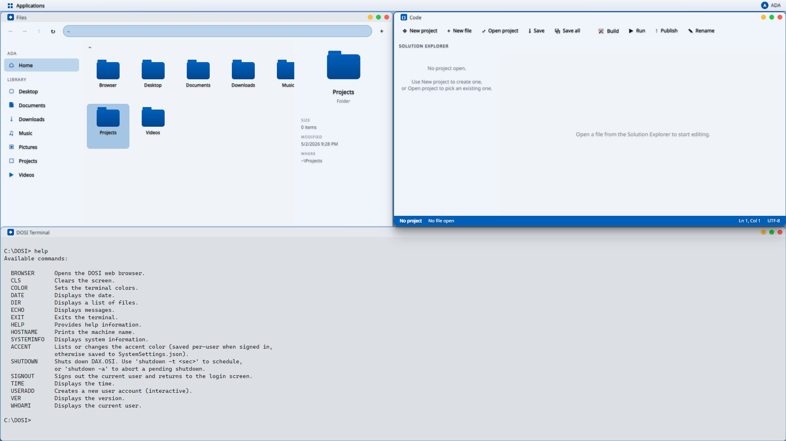</a></td>
    <td><a href="img/17.png">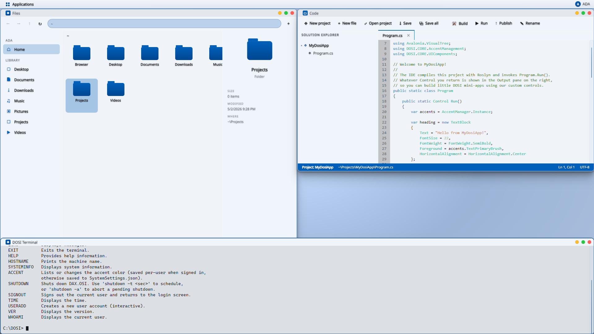</a></td>
    <td><a href="img/18.png">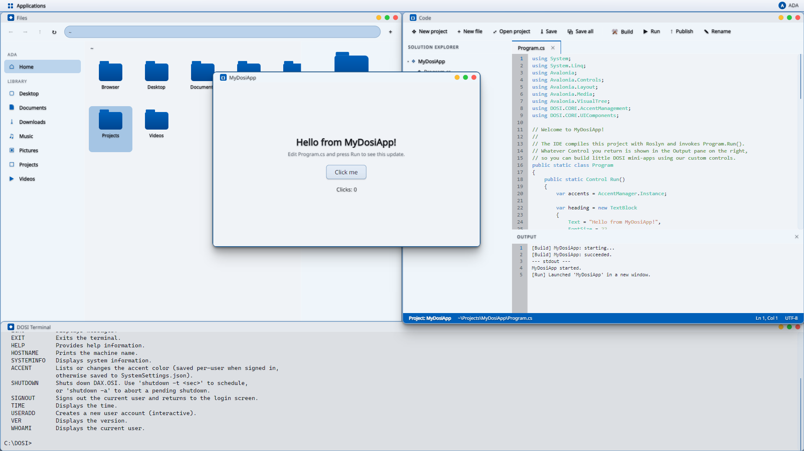</a></td>
  </tr>
  <tr>
    <td colspan="3" align="center"><a href="img/19.png">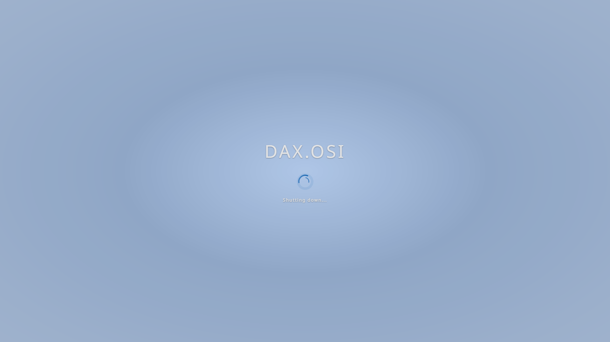</a></td>
  </tr>
</table>

<p align="center"><sub>Click any thumbnail to open the full-resolution screenshot.</sub></p>

---

## Architecture Overview

```
+--------------------------------------------------------------+
|                          DAX.OSI                             |
|  (Avalonia App: BootScreen -> LoginScreen -> DesktopScreen)  |
|                                                              |
|   Default Apps:  Terminal | FileExplorer | Browser | Viewer  |
|   Plug-in Apps:  loaded from <executable>/Plugins/*.dll      |
+----------------------------+---------------------------------+
                             |  references
                             v
+--------------------------------------------------------------+
|                         DOSI.CORE                            |
|                                                              |
|   SystemCore   |  WindowManager  |  UserManager              |
|   AccentMgr    |  ScreenManager  |  WallpaperManager         |
|   UIComponents |  Animations     |  ProjectSystem · Designer |
|   PluginLoader |  LoadedAppRegistry                          |
+----------------------------+---------------------------------+
                             |  references
                             v
+--------------------------------------------------------------+
|                     DAX.OSI.PluginSdk                        |
|                                                              |
|   IDOSIApp · IDOSIAppPlugin (public plug-in contracts)       |
+--------------------------------------------------------------+
                             |
                             v
                       Avalonia · .NET 9
```

The boot flow:

1. `Program.Main` builds the Avalonia `App`.
2. `App.Initialize` registers themes, calls `SystemCore.Initialize()`, and applies the saved accent.
3. `MainWindow` opens and the `ScreenManager` shows `BootScreen` → `LoginScreen` → `DesktopScreen`.
4. `WindowManager` hosts every launched application as a `DOSIWindow` on the desktop.

---

## Project Layout

```
DAX.OSI-Master/
├── DAX.OSI/                    # The shell application (entry point)
│   ├── Program.cs · App.cs · MainWindow.cs
│   ├── UI/                     # BootScreen, LoginScreen, DesktopScreen
│   ├── DefaultApplications/    # Terminal, FileExplorer, Browser, Viewer, ...
│   └── Controls/               # WebViewWrapper, etc.
│
├── DOSI.CORE/                  # The reusable engine / SDK
│   ├── System/                 # SystemCore, SystemShutdown, SystemSignOut
│   ├── Fonts/                  # DOSIFonts
│   ├── UIComponents/           # All DOSI* controls
│   │   └── WindowManagement/   # WindowManager, WindowSnapManager
│   ├── Animations/             # Tween, Easings, loading/success anims
│   ├── ProjectSystem/          # DOSIProject + compiler + registry
│   ├── Designer/               # Visual form designer
│   ├── UserManagement/         # UserManager
│   ├── WallpaperManagement/    # WallpaperManager
│   ├── AccentManagement/       # AccentManager + DOSIAccent enum
│   ├── DOSITerminalManagement/ # DOSITerminalManager
│   └── Plugins/                # PluginLoader + LoadedAppRegistry
│
├── DAX.OSI.PluginSdk/          # Public plug-in contracts (IDOSIApp, IDOSIAppPlugin)
│
├── img/                        # Screenshots used in the Gallery section
└── tutorial.html               # Quick-start interactive tutorial
```

---

## Getting Started

### Prerequisites

- [.NET 9 SDK](https://dotnet.microsoft.com/download/dotnet/9.0)
- Visual Studio 2026 (or any IDE with .NET 9 support)

### Build & Run

```powershell
git clone https://github.com/Kruox/DAX.OSI-Master.git
cd DAX.OSI-Master
dotnet build
dotnet run --project DAX.OSI
```

On first launch DAX.OSI will:

1. Create `SystemSettings.json` next to the executable.
2. Play the boot animation.
3. Drop you at the login screen.

---

## Tutorial

A friendly, interactive walkthrough is included in **[`tutorial.html`](./tutorial.html)** — open it in any browser to see how DAX.OSI boots, how DOSI.CORE plugs in, and how to write your first DOSI app.

---

## Plug-in Apps

DAX.OSI loads additional applications at startup from a **`Plugins/`**
folder next to the executable. Each plug-in is a standalone .NET 9
assembly that:

1. References `DAX.OSI.PluginSdk` (and optionally `DOSI.CORE`)
2. Exposes a public class implementing `IDOSIAppPlugin`
3. Returns one or more `IDOSIApp` instances from `GetApps()`

Discovered apps appear in the **Applications** menu next to the built-in
tiles and participate in file-association routing from the **File
Explorer** via `IDOSIApp.CanOpenFile(extension)`.

```csharp
using DAX.OSI.PluginSdk;
using Avalonia.Controls;

public sealed class MyAppPlugin : IDOSIAppPlugin
{
    public IEnumerable<IDOSIApp> GetApps() { yield return new MyApp(); }
}

internal sealed class MyApp : IDOSIApp
{
    public string Id          => "contoso.myapp";
    public string Title       => "My App";
    public string Description => "Does cool things";
    public Control BuildGlyph() => new Border { /* 26x26 tile glyph */ };
    public Control Activate()   => new MyAppWindow();   // a DOSIWindow
    public bool CanOpenFile(string ext) => false;
    public void OpenPath(Control instance, string path) { }
}
```

Drop the compiled DLL into `<executable>/Plugins/`, restart, and the app
shows up. Removing the DLL removes the app — the host runs unchanged.

### How loading works

`DOSI.CORE.Plugins.PluginLoader` scans `Plugins/*.dll` once at boot. Each
plug-in is loaded into its own `AssemblyLoadContext` whose resolver
redirects shared assemblies (`DOSI.CORE`, `DAX.OSI.PluginSdk`, Avalonia,
BCL) back to the host's already-loaded copies, so type identity is
preserved across the plug-in boundary.

See `DAX.OSI.PluginSdk/PluginContracts.cs` for the full interface
documentation.

### Reference plug-in

An example, **proprietary** plug-in (a Visual-Studio-style code editor +
project system + visual form designer) is shipped as a separate, private
repository. It is **not** part of this open-source codebase.

---

### The `.dosiproj` Project Format

DOSI.CORE's project system stores apps as folders under `~/Projects/<name>/`
with a single `*.dosiproj` JSON manifest:

```jsonc
{
  "Name":         "MyCoolApp",
  "Kind":         "DOSIControl",
  "EntryType":    "Program",
  "EntryMethod":  "Run",
  "FormatVersion": 1
}
```

The IDE's **New Project** button scaffolds this for you and adds a starter `Program.cs`. The `DOSIProjectManager` API (`Create`, `Load`, `ListProjects`, `FindProjectFor`) is also available programmatically.

### Entry Points & The `Run` Convention

When you press **Run**, `DOSIProjectCompiler.BuildAndRun` reflectively invokes the manifest's `EntryType.EntryMethod` as a `static` method:

| `Run()` returns             | What `DOSIProjectCompiler.BuildAndRun` does                        |
|-----------------------------|--------------------------------------------------------------------|
| `void`                      | Executes the code; captures `Console.Out` into the Output pane.    |
| `Avalonia.Controls.Control` | Hosts the returned control inside a real `DOSIWindow`.             |

```csharp
using Avalonia.Controls;
using DOSI.CORE.UIComponents;

public static class Program
{
    public static Control Run()
    {
        var stack = new StackPanel { Spacing = 8, Margin = new(16) };
        stack.Children.Add(new DOSILabel  { Text = "Hello from a DOSI app!" });
        stack.Children.Add(new DOSIButton { Content = "OK" });
        return stack;
    }
}
```

### Script-Style Files

For quick experiments, `DOSIProjectCompiler` accepts top-level statements
without a class or namespace — the compiler auto-wraps them into a
`Program.Run` shape:

```csharp
using DOSI.CORE.UIComponents;
var btn = new DOSIButton { Content = "Click me!" };
btn.Click += (_, _) => System.Console.WriteLine("clicked");
return btn;
```

### Multi-File Projects

Every `.cs` file under the project folder (excluding `bin/` and `obj/`) compiles into a single assembly. You can reference any DOSI control or BCL type freely.

```
MyCoolApp/
├── MyCoolApp.dosiproj
├── Program.cs            # contains static Run()
├── Models/User.cs
├── Views/MainView.cs     # custom DOSIWindow
└── MainForm.dosiform     # designer file (optional)
```

### Building & Running

Programmatic entry points exposed by `DOSI.CORE.ProjectSystem`:

| API | What it does |
|---|---|
| `DOSIProjectCompiler.Build(project)` | Compiles the project in-memory with Roslyn; returns diagnostics + the assembly. |
| `DOSIProjectCompiler.BuildAndRun(project)` | Builds, invokes the entry point, captures stdout, and returns any `Control` the entry returned. |
| `DOSIProject.EnumerateSourceFiles()` | Every `.cs` under the project folder (excluding `bin/` / `obj/`). |
| `DOSIPublishedAppRegistry.Register(...)` | Adds the compiled app to the desktop's apps menu for the current user. |

A host UI (such as the proprietary IDE plug-in) typically wraps these
APIs behind toolbar buttons; the APIs themselves are part of the
open-source DOSI.CORE surface.

### The Visual Form Designer (`.dosiform`)

`DOSI.CORE.Designer.DOSIDesigner` is a re-usable visual designer control
for `.dosiform` files. Each form is a JSON document describing a
`DOSIWindow` and its controls. Designer features:

- Toolbox of every DOSI control (drag onto the canvas)
- Click-to-select, arrow-key nudging, drag-to-move, corner resizing
- 8 px snap-to-grid with grid overlay
- Live property grid for the selected control
- Dirty tracking + JSON save/load

At runtime, `DOSIFormLoader` materialises the JSON into a real `DOSIWindow` — so a pure designer-only project (no `.cs`) can still launch.

### Wiring Event Handlers

Each control has a `Handlers` dictionary mapping **event name → C# code body**. The handler compiler synthesises one method per entry, compiles them into a single class, and wires them to the live instance:

```csharp
// Click handler body for button1:
DOSIPopNotification.Show("Hi", "You clicked " + button1.Content);
```

Form-level events (`Load`, `Closing`) are stored on the form under the synthetic name `Form` and bound to the host `DOSIWindow`.

### Docking & Responsive Layout

Every designed control has a `Dock` property powering responsive re-flow:

| `DOSIDock` | Behaviour                                       |
|------------|-------------------------------------------------|
| `None`     | Honors the absolute X/Y/Width/Height.           |
| `Top`      | Pinned to the top edge, full width.             |
| `Bottom`   | Pinned to the bottom edge, full width.          |
| `Left`     | Pinned to the left edge, full height.           |
| `Right`    | Pinned to the right edge, full height.          |
| `Fill`     | Fills the remaining space.                      |

### Publishing Apps

Once a project builds and runs cleanly, calling
`DOSIPublishedAppRegistry.Register(user, project)` makes it launchable
from the desktop apps menu just like any built-in app.

---

## Roadmap

- [ ] Expanded default app suite
- [ ] Plugin marketplace via `DOSIPublishedAppRegistry`
- [ ] Multi-user profiles and permissions
- [ ] Theming beyond accent colors
- [ ] Networking / virtual filesystem layer

---

## License

See repository for license information.

---

<p align="center">
  <strong>DAX.OSI</strong> — an OS that lives inside a window. <br/>
  Powered by <strong>DOSI.CORE</strong>, .NET 9, and Avalonia.
</p>
